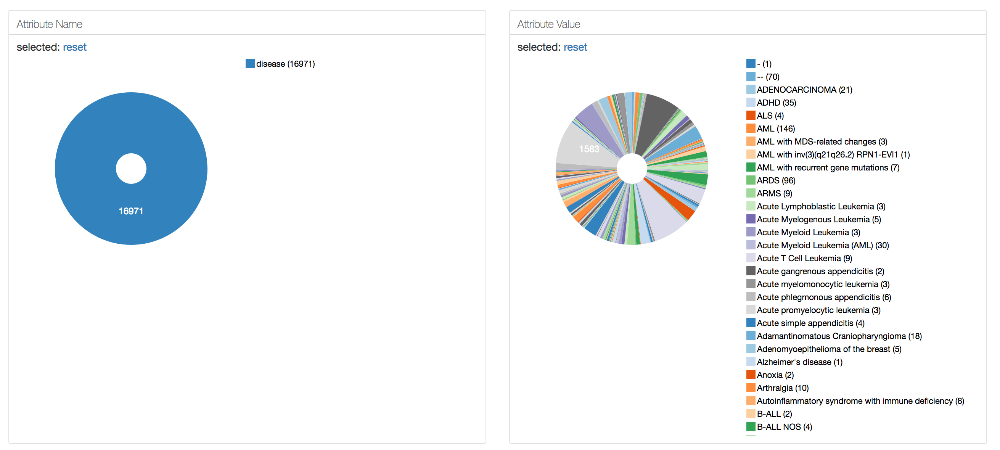
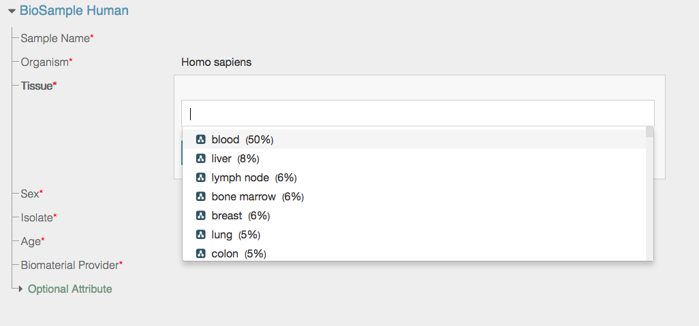

# MetaROOT
## Anney Che
## Kimberley LeBlanc
## Takako Takeda
## Preeti G. Kochar

# What is Metadata?
Metadata is data about data: 
Essential information (like identity, time, location, etc.) about the data. 

When described with standardized ontology, metadata enables other researchers to discover, access, use, repurpose, and cite your data 

# Data: 
## Sequences in SRA, TSA, WGS

# BioProject: 
## Metadata about the study
Accession Number e.g. PRJNA450707
Title and text summary  

# BioSample: 
## Metadata about an individual sample of the study

Field Identifier: e.g. SAMN05771540 Sample name: P4-2; SRA: SRS1702951
Attributes about each sample: Sex, Age, Isolate, tissue, disease, cell line, cell type......
(Author can add own attribute)

# Strategy: For Analyzing Metadata in Human BioSample
use MetaMap on attribute field entries
## Edirect search: 
./esearch -db bioSample -query "human [orgn]" | ./efetch -format docsum | ./xtract -pattern DocumentSummary -element Accession Attribute@attribute_name Attribute

# Analysis:
## unique sex attributes in current human biosample submissions:
    both
    f
    female
    female*
    female and male
    female and male mixture
    female, male
    female/male
    female, pooled
    m
    male
    male and female
    male/female
    male, pooled
    men
    missing
    mixed
    mixed (males and females)
    mixture of female and male
    na
    n/a
    nd
    not applicable
    not available
    not collected
    not determined
    not known
    pooled
    pooled (6)
    pooled male and female
    unknown

# Analysis:
## Diseases
16971 entries have disease field filled out in 2046497 human biosamples

File a: biosample_diseases.mmi   (MetaMap Lite output which was filtered by only disease )

tx|MMI|score|preferredName|CUI#|[semantic type]|matched term-locatiion-0-"Imput term"-NNP-0|0/length of the input term|Mesh code
tx|MMI|32.03|Turner Syndrome|C0041408|[dsyn]|"Turner Syndrome"-text-0-"TURNER SYNDROME"-NNP-0|0/15|C12.706.316.309.872,C12.706.316.795.750,C13.351.875.253.309.872,C13.351.875.253.795.750,C14.240.400.980,C14.280.400.980,C16.131.240.400.970,C16.131.260.830.835.750,C16.131.939.316.309.872,C16.131.939.316.795.750,C16.320.180.830.835.750,C19.391.119.309.872,C19.391.119.795.750

Detailed documents for metamap output field:
https://metamap.nlm.nih.gov/Docs/MMI_Output.pdf
Score threshold:10

Score – MetaMap Indexing (MMI) score with a maximum score of 1000.00.  The higher the score, the greater the relevance of the UMLS concept according to the MMI algorithm.  The MMI results are presented in highest to lowest relevance order. score info https://metamap.nlm.nih.gov/MetaMapLite.shtml

File b extracted only colored items in file a
preferredName|CUI#|[semantic type]|Input term

File c : meta_code.txt (only for disease)
DISO|Disorders|T#|semantic group [semantic type]

DISO|Disorders|T020|Acquired Abnormality [acab]
DISO|Disorders|T190|Anatomical Abnormality [anab]
DISO|Disorders|T049|Cell or Molecular Dysfunction [comd]
DISO|Disorders|T019|Congenital Abnormality [cgab]
DISO|Disorders|T047|Disease or Syndrome [dsyn]
DISO|Disorders|T050|Experimental Model of Disease [emod]

DISO|Disorders|T037|Injury or Poisoning [inpo]
DISO|Disorders|T048|Mental or Behavioral Dysfunction [mobd]
DISO|Disorders|T191|Neoplastic Process [neop]
DISO|Disorders|T046|Pathologic Function [patf]

1. Output using file b and c 
preferredName|CUI#|[semantic type]|Input term| semantic group 

2. Use this output file to convert input term in bioSample attribu te in disease section to preferred term ("NORMALIZE")

## Future:
1. Analyze output:  from BioProject text using MeSH on demand

2. CEDAR has BioSample resources:

